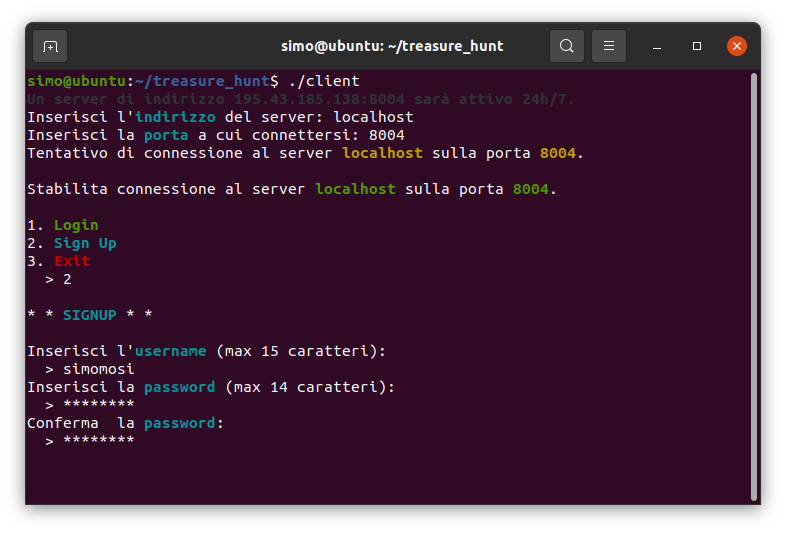
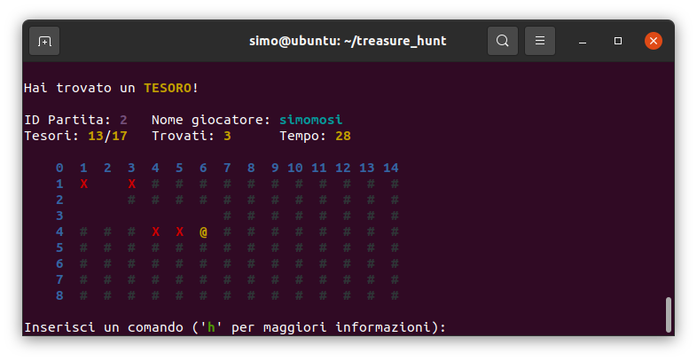
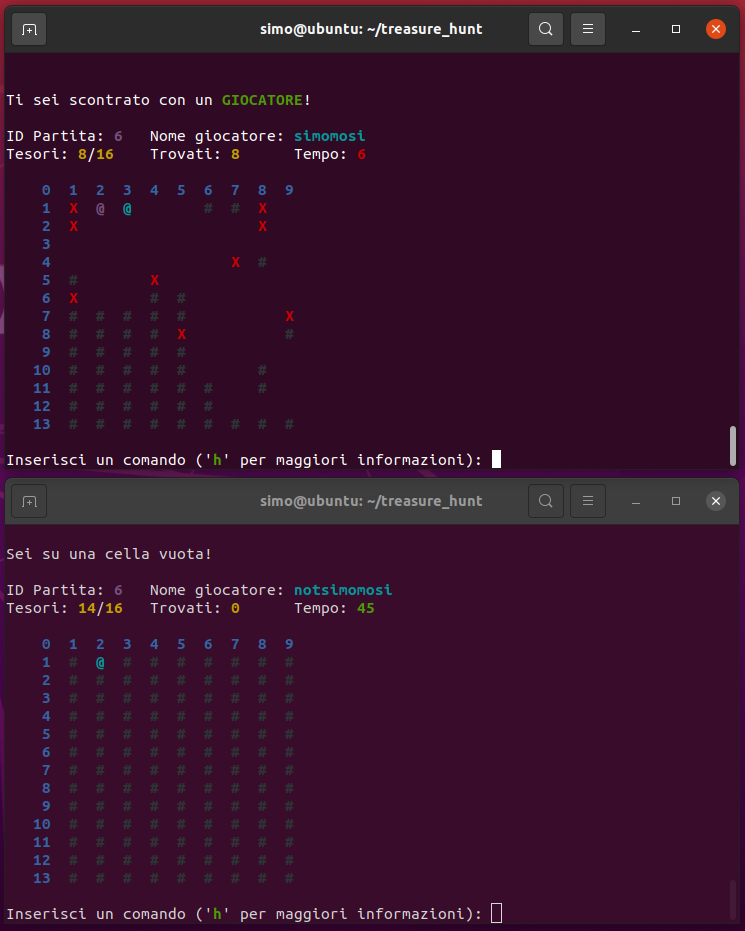

# :joystick: Treasure Hunt

Treasure hunt is an online multiplayer game in which players have to search for as many treasures as possible while avoiding obstacles and other players.

It's an easy game, but it is written in C with no external libraries.

## :rocket: Features

- Play it anywhere in a terminal: create a game-server instance on your desktop, host a LAN party or use a remote server
- Create your account in a safe way: all passwords are encrypted
- Random generated levels
- All from scratch:
  - Client & Server implementation
  - Threads
  - Sockets

## :framed_picture: Screenshots

Create accounts:

Play in a rectangular arena. Colors are used to enhance user experience:

Multiplayer game:

